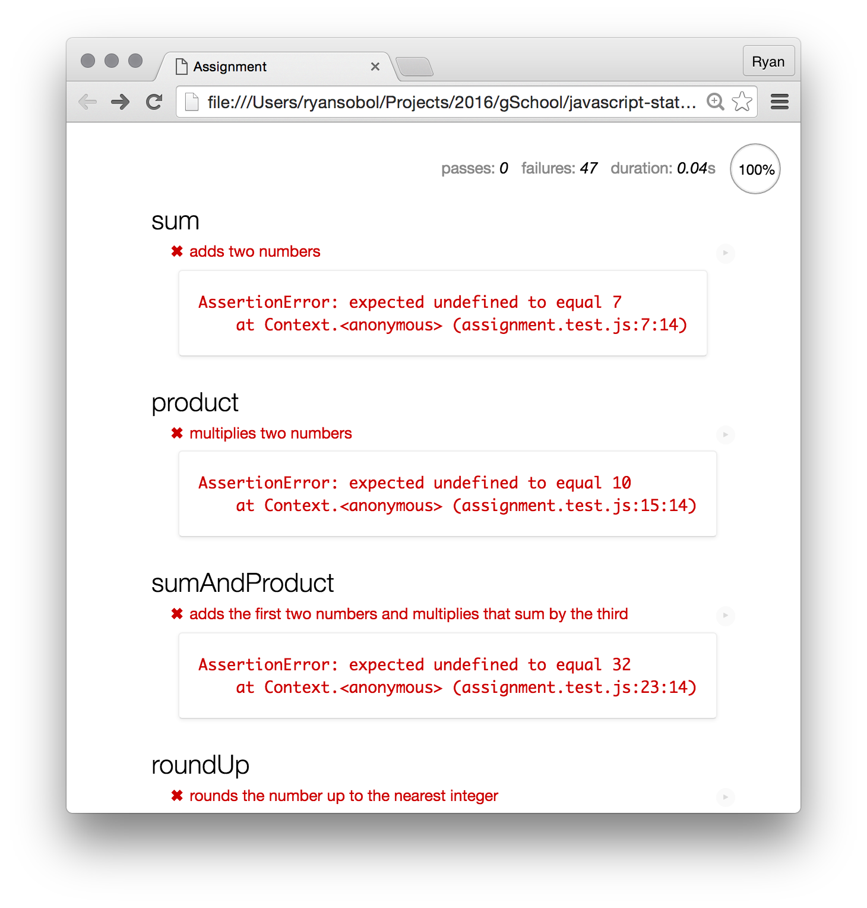

# JavaScript Fundamentals

Welcome to JavaScript. There's so much to do so let's jump right in.

### Objectives

To complete these challenges, you must be able to:

- Write basic JavaScript statements and expressions
- Use online documentation to help solve JavaScript problems

### Setup

To get started, get this code onto your machine by following these setup instructions.

1. Fork this repository to your own GitHub account.
1. Clone your forked repository to your development environment.
1. Open the repository's project directory in your text editor.
1. Open the `part1/assignment.html` file in your web browser.

In your web browser, you'll see a page that shows a bunch of failing JavaScript tests. Locate the area that shows how many tests are passing and how many are failing.

### How to proceed

Your job is to make all these JavaScript tests pass.

- Open the `part1/assignment.js` file in a new tab in your text editor.
- Read the instructions on for each incorrect function.
- Write code to make each function pass the test.

Using the provided links to learn about how to do so. After making a change:

- Tab over to the browser with `Command` + `Tab`.
- Refresh the browser with `Command` + `R`.
- Scroll to the first failing test in red.
- Use the information provided to help you figure out what's next.

You'll tab/refresh hundreds of times during this challenge. Check your work after every small change :)

### Wrestle with it

You may encounter challenges that seem confusing or impossible. Don't fret! This exercise is designed to challenge you. Resist the urge to just copy-paste code from your classmates, but definitely ask for help and talk to your peers.

### What success looks like

When you're done with the main assignment, your page should look like this. Green check marks next to each exercise means all tests are passing.

### Bonus

Want more? There's a whole 'nother test suite just waiting for you!

- Open the `part1/bonus.html` file in your web browser.
- Open the `part1/bonus.js` file in a new tab in your text editor.
- You know the drill :)
